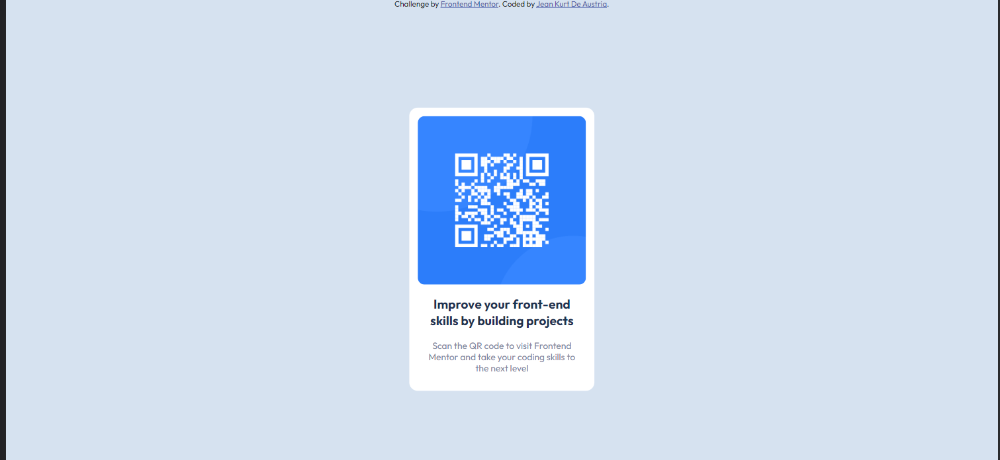

# Frontend Mentor - QR code component solution

This is a solution to the [QR code component challenge on Frontend Mentor](https://www.frontendmentor.io/challenges/qr-code-component-iux_sIO_H). Frontend Mentor challenges help you improve your coding skills by building realistic projects. 

## Table of contents

- [Overview](#overview)
  - [Screenshot](#screenshot)
  - [Links](#links)
- [My process](#my-process)
  - [Built with](#built-with)
  - [What I learned](#what-i-learned)
  - [Continued development](#continued-development)
  - [Useful resources](#useful-resources)
- [Author](#author)
- [Acknowledgments](#acknowledgments)

**Note: Delete this note and update the table of contents based on what sections you keep.**

## Overview

### Screenshots




## My process

First, I created a card div containing qr code image and the text. By centering the div and placing the items at the center.
Creating a headline and a subheadline with different usage of weights. 

Border radius on each corners of the card and the picture.

### Built with

- Semantic HTML5 markup
- CSS
- CSS Grid
- CSS Media Queries
- Mobile-first workflow

### What I learned

I engage myself primarily on frameworks because of its built in "responsiveness" on mobile and web. So, I went back to basics
and learnt about media queries.

So happy to use this!
```css
@media only screen and (max-width: 1440px){
    .card{
        width: 17%;
        margin: 10% auto;
    }
    .subhead{
        width: 90%;
    }
}
@media only screen and (max-width: 376px) {
    
    .card{
        width: 60%;
        margin: 30% auto;
    }

}
```

## Author

- Website - [Jean Kurt De Austria](https://www.raket.ph/kurtdeaustria11)
- Frontend Mentor - [@Kurt-Chan](https://www.frontendmentor.io/profile/Kurt-Chan)